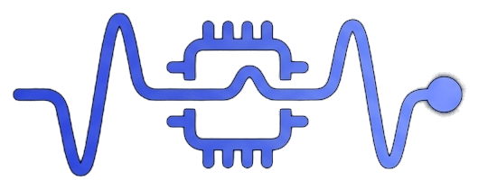

#  ELRSense

ELRSense is an open-source framework for adding custom sensor telemetry
to ExpressLRS receivers using ESP32 and Arduino Pro Mini (3.3V/8MHz).

## Repository layout

- `firmware/` -- CRSF frame encoding, board pin/UART abstractions, and
  sensor driver modules (see `firmware/README.md`).
- `configurator/` -- static, client-side web app that assembles a
  ready-to-flash, single-file Arduino IDE `.ino` from a board + sensor
  selection (targets the ESP32-C3 Zero or the Arduino Pro Mini
  3.3V/8MHz; see `configurator/README.md` for running it locally).
- `reference/` -- known-working reference implementations, including the
  CRSF protocol spec (`reference/pro-mini-crsf-temp/crsf.md`) used as the
  source of truth for every frame layout in `firmware/`.

## License and Usage

ELRSense is licensed under the GNU General Public License v3.0.

This project is developed primarily for:
- Hobbyists
- Makers
- Educational projects
- Personal RC applications

We encourage the RC community to use, modify, and improve ELRSense.

If you are interested in using ELRSense in a commercial product,
please contact the maintainers before integration so we can discuss
appropriate collaboration and licensing options.

Commercial users must comply with all requirements of the GPL-3.0 license.
